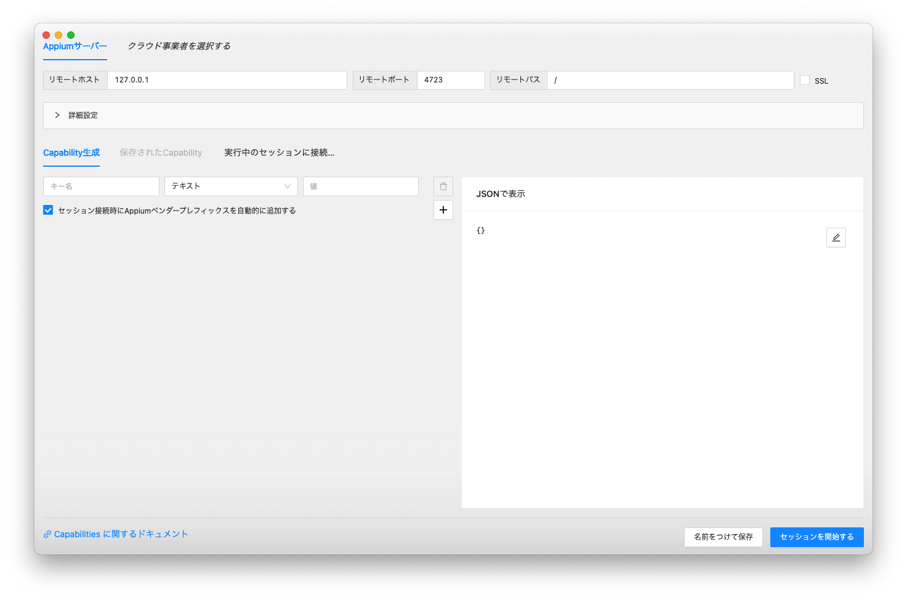
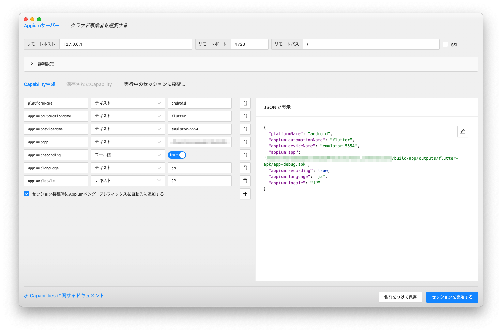
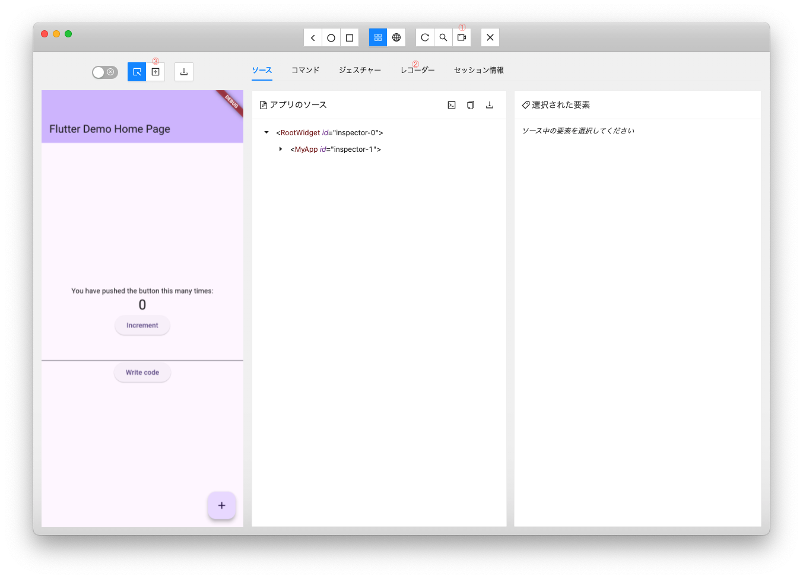
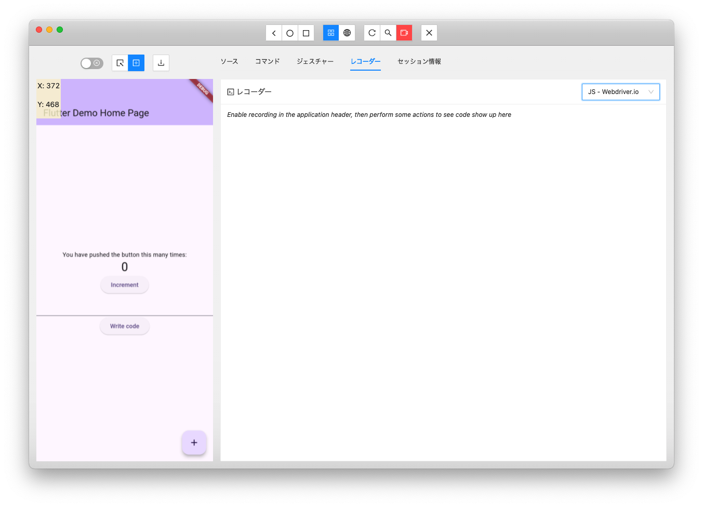
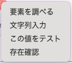
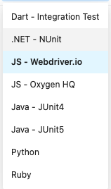

# Appium Flutter Driverを改良し、Appium Inspectorを“automationName":"flutter”で動作するようにしてみた

<!-- TOC -->

- [目次](#目次)
    - [1. はじめに](#1-はじめに)
    - [2. 背景](#2-背景)
    - [3. 改良点](#3-改良点)
        - [3.1. **Appium Flutter Driver の手直し**<br>](#31-appium-flutter-driver-の手直しbr)
        - [3.2. **Appium Inspector の手直し**<br>](#32-appium-inspector-の手直しbr)
        - [3.3. **Appium Handler の新規作成**<br>](#33-appium-handler-の新規作成br)
    - [4. 起動方法](#4-起動方法)
        - [4.1. **Appiumをインストールし、起動する**](#41-appiumをインストールし起動する)
        - [4.2. **改良版Appium Flutter Driverをインストールする**](#42-改良版appium-flutter-driverをインストールする)
        - [4.3. **改良版Appium Inspectorをビルドする**](#43-改良版appium-inspectorをビルドする)
        - [4.5. **テストアプリを用意する**](#45-テストアプリを用意する)
        - [4.6. **改良版Appium Inspectorを起動する**](#46-改良版appium-inspectorを起動する)
    - [5. 操作方法](#5-操作方法)
        - [5.1. **アプリ起動パラメータの設定**](#51-アプリ起動パラメータの設定)
        - [5.2. **テストスクリプトの生成**](#52-テストスクリプトの生成)
    - [6. まとめ](#6-まとめ)
    - [7. 参考文献](#8-参考文献)

<!-- /TOC -->

## 1. はじめに

Flutterは近年、モバイルアプリ開発の主流なフレームワークの一つとして急速に普及しています。その一方で、モバイルアプリのテスト自動化においても、Flutterアプリを効率的にテストできるツールが求められています。

そこで今回は、FlutterアプリをAndroidやiOSのアプリとしてテストするのではなく、Flutterアプリとしてテストする方法を探ってみました。

## 2. 背景

モバイルアプリのテストツールはいろんなものが世に出回っていますが、Flutter Driverというものを取り入れているAppiumを扱ってみることにしました。

Appiumは、Android、iOSなどの様々なモバイルプラットフォームに加え、Webアプリiに対応したアプリテスト自動化フレームワークです。Appium Driverは、Appiumとテストスクリプトを接続する役割を担い、テストスクリプトからモバイルアプリを操作したり、情報を取得したりすることができます。

Appium Inspectorは、Appiumのスクリプト生成の手助けをするGUIツールであり、モバイルアプリのUI要素を視覚的に確認したり、要素情報を確認したりすることができます。

しかし、従来のAppium Flutter Driverでは、Appium Inspectorが正常に動作しない状態でした。

この課題を解決するために、今回、Appium Flutter DriverとAppium Inspectorを改良し、Appium Inspectorを *“automationName":"flutter”* で動作するようにしました。これにより、Flutterアプリのテスト自動化をAppiumの豊富な機能を活用して行うことが可能になります。


## 3. 改良点

今回、以下の3点の改良を行いました。

### 3.1. **Appium Flutter Driver の手直し**<br>
Appium Flutter Driverには、Appium Inspectorから送られるコマンドに対応できていないものがありました。それらに対応することにより、デバイス画面の表示等を行えるようになりました。<br>
### 3.2. **Appium Inspector の手直し**<br>
Appium Inspectorには、画面上の要素のタップ等を行うと、それに対応するスクリプトのコードを生成する機能があります。しかし、それらは座標指定で行うものでした。座標指定だとデバイスが変わるとタップする位置等が違ってしまい、正しい結果を得られない可能性があります。そこで、座標指定であったスクリプトをWidget指定になるよう修正しました。指定方法は、現在flutter_driverがサポートしている、ByType、ByValueKey、ByTooltipMessage、BySemanticsLabel、ByTextになります。
また、デバッグ用スクリプトに「Dart」を追加し、Integration Testでも使えるようにしました。<br>
### 3.3. **Appium Handler の新規作成**<br>
Appium Handlerと呼ばれる新しいコンポーネントを作成しました。このコンポーネントはAppium Flutter Driverからテスト対象アプリに出される要求を処理するコールバック関数を含みます。アプリの画面取得やWidget Treeの取得はここで行なっています。このコンポーネントはテスト対象アプリに組み込む必要があります。

なお、動作確認は、macOS14.5で行なっております。

## 4. 起動方法

Node,jsおよびnpmが使用できるようになっている必要があります。
「/path/to」と記述されている所は、ご自分の環境に合わせて変更してください。

### 4.1. **Appiumをインストールし、起動する**

```
sudo npm i -g appium
/usr/local/bin/appium
```

### 4.2. **改良版Appium Flutter Driverをインストールする**

```terminalで
git clone https://github.com/baleen-studio/appium-flutter-driver
cd ./appium-flutter-driver/driver
./release.sh
cd ../..
appium driver install --source local /path/to/appium-flutter-driver/driver
```

### 4.3. **改良版Appium Inspectorをビルドする**

```terminalで
git clone https://github.com/baleen-studio/appium-inspector
cd ./appium-inspector
npm install
npm run build
```

### 4.5. **テストアプリを用意する**
  テスト対象となるアプリをdebug版として作成し、起動確認しておきます。
  アプリにはAppium Handlerの初期化処理が必要となります。
    
  Appium Handlerは下記より取得
    
```
git clone https://github.com/baleen-studio/appium-handler
```
 
   pubspec.yamlに下記を追加
    
```pubspec.yaml
appium_handler:
path: /path/to/appium_handler
```

   main.dartに下記を追加

```
import 'package:flutter_driver/driver_extension.dart';
import 'package:appium_handler/appium_handler.dart';

void main() {
　var handler = AppiumHandler();
　enableFlutterDriverExtension(
　　handler: handler.appiumHandler,
　);
　handler.buildDriverExtension();
　runApp(const MyApp());
}
```

作成されたアプリが存在する場所を確認しておきます。
Androidの場合：/path/to/your/project/build/app/outputs/flutter-apk/app-debug.apk
iOSの場合：/path/to/your/project/build/ios/iphonesimulator/Runner.app(シミュレータの場合)
　　　　　　これをZIPで圧縮し、以下を作成。
　　　　　　/path/to/your/project/build/ios/iphonesimulator/Runner.zip

### 4.6. **改良版Appium Inspectorを起動する**
先ほどビルドを行ったディレクトリで
  
```
npm run start
```
  
スプラッシュ画面の後、下記のような画面が表示されます。



## 5. 操作方法

### 5.1. **アプリ起動パラメータの設定**

画面右側の白い部分にある鉛筆アイコンをクリックすると、編集可能になるので、下記内容を入力します。

Androidの場合：

```
{
    "platformName": "android",
    "appium:automationName": "flutter",
    "appium:deviceName": "yourDeviceName",
    "appium:app": "/path/to/your/project/build/app/outputs/flutter-apk/app-debug.apk",
    "appium:recording": true,
    "appium:language": "ja",
    "appium:locale": "JP"
}
```

iOSの場合：

```
{
    "platformName": "ios",
    "appium:automationName": "flutter",
    "appium:deviceName": "yourDeviceName",
    "appium:app": "/path/to/your/project/build/ios/iphonesimulator/Runner.zip",
    "appium:recording": true,
    "appium:includeSafariInWebviews": true,
    "appium:language": "ja",
    "appium:locale": "JP"
}
```

入力終了後、鉛筆アイコンから変わったフロッピーアイコンをクリックし、起動パラメータの設定を終了します。
すると、下記のようにパラメータが設定されます。



この状態で、右下の「セッションを開始する」ボタンをクリックすると、上記で指定したデバイス上で指定されたアプリが起動し、テスト操作待ちとなります。起動したアプリの画面が、Appium Inspectorのアプリ画面エリアに表示されます。

生のFlutterのWidgetTreeは非常に長く深いものなのですが、この画面の「アプリソース」には、ソースコードに記述した分のWidgetTreeのみが表示されるようになっています。



### 5.2. **テストスクリプトの生成**

上記画面内の①レコーディング開始、②レコーダー画面、③座標でタップ/スワイプをクリックし、テストスクリプトを出力できる状態にします。



この状態で、右下の「＋」ボタンを２回クリックし、真ん中に表示されている数字が「２」となるかを確認するテストスクリプトを生成させます。
テストターゲットの期待値を入力するには、画面上でそのターゲット上で右クリックし、出力されるメニューから「この値をテスト」を選択します。
右クリックで表示されるコンテキストメニューは下記のようなものです。

| メニュー                         | 説明                                                                                                                                                                |
|------------------------------|-------------------------------------------------------------------------------------------------------------------------------------------------------------------|
|  | 「要素を調べる」は元々あるもので、ブラウザの要素調査画面が右側に表示されます<br>「文字列入力」はTextField等を右クリックし、文字列を入力することができます<br>「この値をテスト」は右クリックした要素がどう表示されるかをチェックします <br>「存在確認」は右クリックした要素が画面上に存在するかチェックします |

アプリ画面を操作するたびに、デバイス画面が操作された状態になり、その画面がAppium Inspectorにコピーされます。
最終的に、このようなコードを生成できます。

```
await driver.touchAction({
  action: 'tap',
  element: { elementId: find.byTooltip('Increment') }
});
await driver.touchAction({
  action: 'tap',
  element: { elementId: find.byTooltip('Increment') }
});
assert.strictEqual(
  await driver.getElementText(
    await driver.elementSendKeys(find.byValueKey('counter')),
  '2'
);
```

このコードはNode.js用のコードになります。違う言語に変更したい場合は、右上のプルダウンで言語を変更すれば、その場で違う言語にコンバートされます。
扱える言語は以下の通りです。



生成されたコードを実行させるには、それぞれの言語の実行環境が必要です。この辺りはAppiumの本家のホームページでご確認ください。
Dartに関しては、Flutterのインテグレーションテストをご覧ください。

## 6. まとめ

今回の改良により、Appium InspectorをAppium Flutter Driverで動作させることが可能になりました。これにより、以下のメリットが得られます。

* **Flutterアプリのテスト自動化をAppiumの豊富な機能で実現**
* **テストスクリプトの作成作業の効率化**

今後、Appium Inspectorの機能で、動作しないところを修正し、Flutterアプリのテスト自動化をより効率的に行えるようにしていきたいと考えています。

## 7. 参考文献

- [Flutter](https://flutter.dev/)
* [Appium](https://appium.io/docs/en/latest/)
* [Appium Flutter Driver](https://github.com/appium/appium-flutter-driver)
* [Appium Inspector](https://github.com/appium/appium-inspector)
