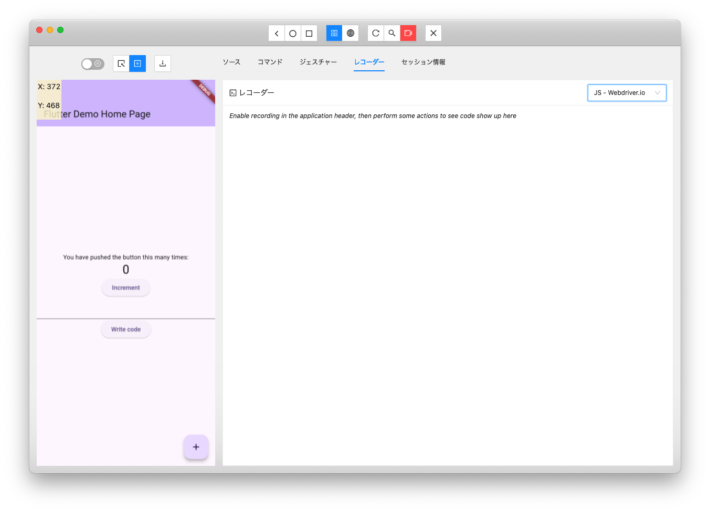

# Improved Appium Flutter Driver to Make Appium Inspector Work with “automationName":"flutter”

<!-- TOC -->

- [Table of Contents](#table-of-contents)
    - [1. Introduction](#1-introduction)
    - [2. Background](#2-background)
    - [3. Improvements](#3-improvements)
        - [3.1. **Tweaks to Appium Flutter Driver**](#31-tweaks-to-appium-flutter-driver)
        - [3.2. **Tweaks to Appium Inspector**](#32-tweaks-to-appium-inspector)
        - [3.3. **Creation of Appium Handler**](#33-creation-of-appium-handler)
    - [4. How to Start](#4-how-to-start)
        - [4.1. **Install and Start Appium**](#41-install-and-start-appium)
        - [4.2. **Install the Improved Appium Flutter Driver**](#42-install-the-improved-appium-flutter-driver)
        - [4.3. **Build the Improved Appium Inspector**](#43-build-the-improved-appium-inspector)
        - [4.5. **Prepare the Test App**](#45-prepare-the-test-app)
        - [4.6. **Start the Improved Appium Inspector**](#46-start-the-improved-appium-inspector)
    - [5. How to Operate](#5-how-to-operate)
        - [5.1. **Set App Launch Parameters**](#51-set-app-launch-parameters)
        - [5.2. **Generate Test Scripts**](#52-generate-test-scripts)
    - [6. Summary](#6-summary)
    - [7. References](#7-references)

<!-- /TOC -->

## 1. Introduction

Flutter has rapidly become one of the mainstream frameworks for mobile app development in recent years. Alongside this, there is a growing demand for tools that can efficiently test Flutter apps in mobile app test automation.
This time, we explored a method to test Flutter apps not as Android or iOS apps but as Flutter apps.

## 2. Background

While there are many mobile app testing tools available, we decided to use Appium, which incorporates the Flutter Driver.
Appium is an app test automation framework that supports various mobile platforms like Android and iOS, as well as web apps. The Appium Driver connects Appium with test scripts, enabling the operation and data retrieval from mobile apps through test scripts.
Appium Inspector is a GUI tool that assists in generating Appium scripts, allowing users to visually inspect UI elements and check element information in mobile apps.
However, the conventional Appium Flutter Driver did not work properly with Appium Inspector.
To address this issue, we improved the Appium Flutter Driver and Appium Inspector to work with Appium Inspector using *“automationName":"flutter”*. This allows us to leverage Appium's rich features for automating the testing of Flutter apps.

## 3. Improvements

We made the following three improvements:

### 3.1. **Tweaks to Appium Flutter Driver**
The Appium Flutter Driver had commands that were not compatible with those sent by Appium Inspector. By addressing these issues, it is now possible to display the device screen, among other things.
### 3.2. **Tweaks to Appium Inspector**
Appium Inspector has a feature that generates script code corresponding to actions like tapping elements on the screen. However, these actions were specified by coordinates. Coordinate-based actions may yield incorrect results when the device changes. Therefore, we modified the scripts to use Widget specifications instead of coordinates. The specification methods include those currently supported by flutter_driver: ByType, ByValueKey, ByTooltipMessage, BySemanticsLabel, and ByText.
Additionally, we added "Dart" for debugging scripts, making it usable in Integration Tests.
### 3.3. **Creation of Appium Handler**
We created a new component called Appium Handler. This component contains callback functions that process requests issued from the Appium Flutter Driver to the test target app. Screen capture and Widget Tree retrieval are performed here. This component needs to be integrated into the test target app.

We confirmed the operation on macOS 14.5.

## 4. How to Start

You need to have Node.js and npm available.
Please replace "/path/to" with the appropriate paths for your environment.

### 4.1. **Install and Start Appium**

```
sudo npm i -g appium
/usr/local/bin/appium
```
When started, the terminal becomes unusable, so either start it with "&" or use another terminal for subsequent operations.

### 4.2. **Install the Improved Appium Flutter Driver**

```bash
git clone https://github.com/baleen-studio/appium-flutter-driver
cd ./appium-flutter-driver/driver
./release.sh
cd ../..
appium driver install --source local /path/to/appium-flutter-driver/driver
```

### 4.3. **Build the Improved Appium Inspector**

```bash
git clone https://github.com/baleen-studio/appium-inspector
cd ./appium-inspector
npm install
npm run build
```

### 4.5. **Prepare the Test App**
Create the app to be tested as a debug version and confirm its launch.
The app needs to have Appium Handler initialization processing.

Obtain the Appium Handler from the following:

```bash
git clone https://github.com/baleen-studio/appium-handler
```

Add the following to pubspec.yaml:

```yaml
appium_handler:
  path: /path/to/appium_handler
```

Add the following to main.dart:

```dart
import 'package:flutter_driver/driver_extension.dart';
import 'package:appium_handler/appium_handler.dart';

void main() {
  var handler = AppiumHandler();
  enableFlutterDriverExtension(
    handler: handler.appiumHandler,
  );
  handler.buildDriverExtension();
  runApp(const MyApp());
}
```

Confirm the location of the created app.
For Android: /path/to/your/project/build/app/outputs/flutter-apk/app-debug.apk
For iOS: /path/to/your/project/build/ios/iphonesimulator/Runner.app (simulator)
Compress it into a ZIP to create the following:
/path/to/your/project/build/ios/iphonesimulator/Runner.zip

### 4.6. **Start the Improved Appium Inspector**
In the directory where the build was performed:

```bash
npm run start
```

After the splash screen, a screen like the following will appear.


## 5. How to Operate

### 5.1. **Set App Launch Parameters**

Click the pencil icon in the white area on the right side of the screen to make it editable, and enter the following content.

For Android:

```json
{
    "platformName": "android",
    "appium:automationName": "flutter",
    "appium:deviceName": "yourDeviceName",
    "appium:app": "/path/to/your/project/build/app/outputs/flutter-apk/app-debug.apk",
    "appium:recording": true,
    "appium:language": "ja",
    "appium:locale": "JP"
}
```

For iOS:

```json
{
    "platformName": "ios",
    "appium:automationName": "flutter",
    "appium:deviceName": "yourDeviceName",
    "appium:app": "/path/to/your/project/build/ios/iphonesimulator/Runner.zip",
    "appium:recording": true,
    "appium:includeSafariInWebviews": true,
    "appium:language": "ja",
    "appium:locale": "JP"
}
```

After entering the details, click the floppy icon that replaced the pencil icon to finish setting the launch parameters.

Then, as shown below, the parameters will be set.


In this state, click the "Start Session" button at the bottom right, and the specified app will launch on the specified device, waiting for test operations. The screen of the launched app will be displayed in the Appium Inspector's app screen area.

The raw Flutter WidgetTree is very long and deep, but in the "App Source" of this screen, only the WidgetTree written in the source code is displayed.


### 5.2. **Generate Test Scripts**

In the screen above, click "Start Recording," "Recorder Screen," and "Tap/Swipe by Coordinates" to enable test script output.



In this state, click the "+" button at the bottom right twice to generate a test script that checks whether the number in the middle is "2."
To input the expected value of the test target, right-click on the target on the screen and select "Test This Value" from the menu that appears.
The context menu that appears on right-click is as follows:

| Menu                                  | Description                                                                                                                                                                                                                                        |
|---------------------------------------|----------------------------------------------------------------------------------------------------------------------------------------------------------------------------------------------------------------------------------------------------|
|  | "Inspect Element" is the original option, displaying the element inspection screen on the right<br>"Enter String" allows you to input a string by right-clicking on a TextField, etc.<br>"Test This Value" checks how the right-clicked element is |

